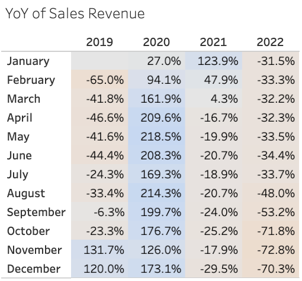

# Elist-Retail-Analysis-Orders-to-Insights
## Project Overview
This analysis explores sales data from Elist, an electronics retailer offering electronics products. The goal of the project is to uncover sales trends, product performance insights, loyalty program effectiveness, and regional demand patterns to support data-driven business decisions.

## Table of Contents
### 1. Executive Summary ###
   Elist recorded a **total sales revenue of $28.12M** over a **2019 - 2022 year period**, with approximately **108k orders** placed across all the product categories, including laptops, audio devices, phones and accessories.

   Sales performance showed a clear concentration in high-value products, with **MacBooks Air Laptops and ThinkPads Laptops** consistently contributing the majority of total revenue despite lower order volumes. With overall **6880 order counts** and **$ 1381.05 average order value (AOV)** was largely driven by laptop sales, highlighting the importance of premium products to overall business performance.

From a regional perspective, **North America** emerged as the strongest market, accounting for the largest share of **51.75%** revenue across all years. In contrast, other regions like **APAC and LATAM** showed comparatively lower demand and higher variability in product performance, indicating opportunities for targeted regional strategies and improved market penetration.

Analysis of customer behavior revealed that **12% in 2019 to over 50% by 2021** grew by **loyalty program members**, with higher repeat purchase rates compared to non-members. However, with **$30** difference in **AOV between loyalty and non-loyalty customers** suggests that the program may benefit from stronger incentives and personalization to further drive engagement and long-term retention.

Overall, the analysis highlights Elist’s reliance on premium products for revenue growth, the strong performance of the North American market, and clear opportunities to enhance loyalty program effectiveness and regional sales strategies.

### 2. Insights Deep Dive ###
#### 1. Sales Trends Analysis ####

| Insight Area | Key Observation | Business Interpretation |
|------|-------------|-------------|
| YoY Growth | 2021 shows strong YoY growth across most months, while 2022 shows consistent YoY decline | Indicates post-pandemic peak in 2021 followed by demand normalization in 2022 |
| Seasonality | Sales peak during Aug–Dec across multiple years | Q3–Q4 are critical revenue-driving periods |
| Volatility | Large MoM fluctuations observed, especially in 2020 | Reflects external shocks and recovery cycles impacting revenue |

#### Key Insights ####

2021 represents the strongest revenue year, driven by sustained YoY growth across most months.

2022 shows significant YoY contraction, especially in the second half of the year, signaling demand slowdown.

Sales exhibit clear seasonality, with consistent uplift during Q3–Q4, making these months critical for planning. 

#### 2. Orders Analysis ####

| Insight Area | Key Observation | Business Interpretation |
|------|-------------|-------------|
| YoY Growth Pattern | Strong YoY growth in 2020 and 2021 across most months, followed by sharp declines in 2022 | Demand surged during recovery years and weakened significantly in 2022 |
| Seasonality | Orders consistently peak during Q3–Q4 | Seasonal demand and campaigns strongly influence order volume |
| Volatility | 2022 shows steep negative YoY values (especially Sep–Dec) | Indicates customer demand contraction rather than short-term fluctuation |

#### Key Insights ####

Order volumes experienced strong YoY expansion in 2020–2021, reflecting increased customer acquisition and demand.

A sharp YoY decline in 2022 suggests a slowdown in customer purchasing behavior rather than operational issues.

Seasonal spikes in Q3–Q4 remain consistent, highlighting the importance of demand planning during peak months.

#### 3. Average Order Value (AOV) ####

  
| Insight Area | Key Observation | Business Interpretation |
|------|-------------|-------------|
| YoY Stability | AOV remains relatively stable compared to orders and sales | Revenue volatility is driven more by volume than basket size |
| 2021 Decline | Majority of 2021 months show negative YoY AOV | Increased discounting or shift toward lower-priced products |
| 2022 Recovery | AOV decline moderates in 2022 with some positive YoY months | Pricing strategy or product mix improvement |

#### Key Insights ####

AOV is significantly more stable than sales or orders, making it a reliable efficiency metric.

Declining AOV in 2021 suggests aggressive promotions or changes in product mix to drive volume.

Partial AOV recovery in 2022 indicates improved pricing discipline or customer purchasing behavior.

      
   ### 2. Product Performance Analysis ###
      1. Area Evaluated
      2. Key Findings
      3. Recommendations
         
   ### 3. Loyalty Program Evaluation ###
      1. Evaluation Focus
      2. Key findings
      3. Recommendations
   ### 4. Regional Performance Analysis ###
      1. Regions Analyzed
      2. Key Findings
      3. Recommendations
      
4. Business Impact & Next Steps
   1. Overall Insights
   2. Future Enhancements
      
        
        
